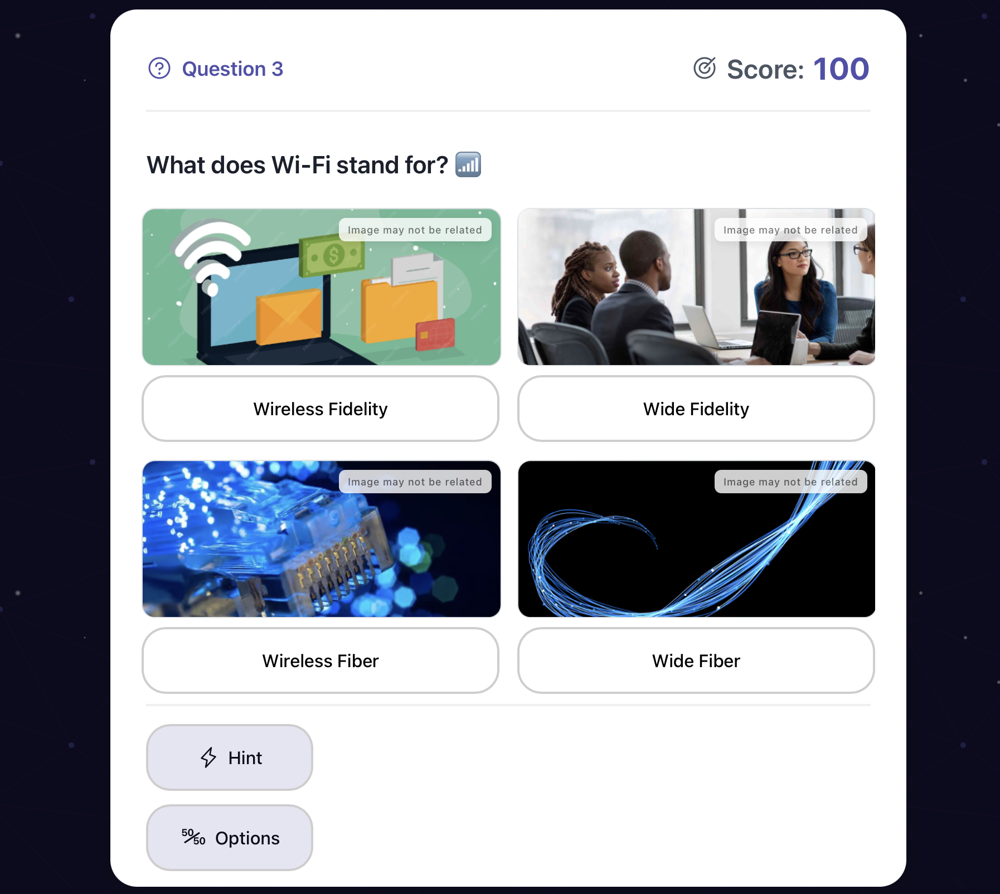

# Astral Quiz
Eine interaktive Quizanwendung, die personalisierte Fragen zu jedem Thema mit den GPT-Modellen von OpenAI erstellt. Diese Anwendung erstellt spannende, sich steigernde Quizfragen mit automatischen Hinweisen und Punktesystem.

[Live Demo](https://astral-quiz.netlify.app) 🚀




## 🎮 Wie man spielt

1. Gib ein Thema ein
2. Gib deinen OpenAI API-Schlüssel ein
3. Beantworte Fragen mit steigendem Schwierigkeitsgrad (Das Quiz läuft unendlich weiter, solange du die Fragen richtig beantwortest)
4. Verwende die Hinweise strategisch (3 pro Spiel verfügbar)
5. Versuche, die höchste Punktzahl zu erreichen.
   

## 🔑 API-Schlüssel

- Du benötigst deinen eigenen OpenAI API-Schlüssel, um Fragen zu generieren
- Dein OpenAI-Konto muss verfügbare Kreditpunkte haben
- Fragen werden mit dem GPT 4o-mini Modell generiert


## 💻 Technische Stack
### Frontend
- **React.js**: Frontend-Framework
- **Vite**: Build-Tool und Entwicklungsserver
- **@phosphor-icons/react**: Icon-Bibliothek
- **CSS**: Benutzerdefinierte Responsive Design

### Backend
- **Node.js**: Runtime-Umgebung
- **Express.js**: Webanwendungsframework
- **OpenAI API**: Für die Generierung von Quizfragen
- **CORS**: Cross-Origin Resource Sharing Unterstützung

### Deployment
- **Frontend**: Hosted auf Netlify
- **Backend**: Hosted auf Fly.io

## 🚀 Einstieg

1. Klonen Sie das Repository
```bash
git clone https://github.com/majd-karoun/astral-quiz.git
cd astral-quiz
```

2. Installieren Sie die Abhängigkeiten
```bash
# Installieren Sie die Frontend-Abhängigkeiten
cd client
npm install

# Installieren Sie die Backend-Abhängigkeiten
cd ../server
npm install
```

3. Setzen Sie die Umgebungsvariablen

Frontend (.env):
```bash
VITE_API_URL=http://localhost:3001/api
```

Backend (.env):
```bash
PORT=3001
NODE_ENV=development
```

4. Starten Sie die Entwicklungsserver
```bash
# Starten Sie den Backend-Server
cd server
node server.js

# Starten Sie den Frontend-Server in einem neuen Terminal
cd client
npm run dev
```


## 🛠️ Anwendungsstruktur

### Frontend
```
client/
├── src/
│   ├── components/
│   │   ├── TopicInput/
│   │   └── LoadingScreen/
│   ├── App.jsx
│   ├── App.css
│   └── main.jsx
```

### Backend
```
server/
├── server.js
└── package.json
```


## 🤝 Beitrag Leisten

1. Forken Sie das Repository
2. Erstellen Sie einen Feature-Branch (`git checkout -b feature/AmazingFeature`)
3. Commiten Sie Ihre Änderungen (`git commit -m 'Add some AmazingFeature'`)
4. Pushen Sie den Branch (`git push origin feature/AmazingFeature`)
5. Erstellen Sie einen Pull Request
